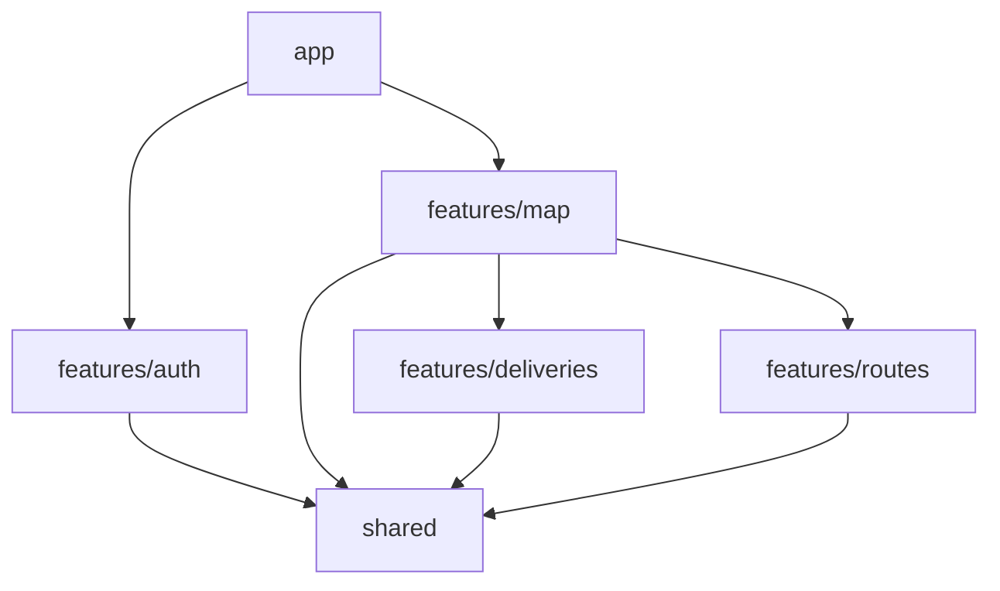

# Architecture Overview

## Layers

```
src/
├── app/            ← App composition (routing, providers)
├── shared/         ← Cross-cutting (UI kit, API client, layout, hooks)
└── features/       ← Domain features (auth, map, deliveries, routes, orders)
```

### Layer Rules

1. **`app/`** orchestrates the application. Contains router config and providers wrapper.
2. **`shared/`** has no knowledge of any feature. Exposes generic utilities, UI components, and layout shell.
3. **`features/`** contain domain logic. Features can depend on `shared/` and on other features (via their barrel exports).

### Dependency Direction



**Never**: `shared/` → `features/`, `app/` → `shared/` (not directly — only features consume shared, app consumes features).

## Feature Anatomy

Each feature follows this standard structure:

```
features/<name>/
├── index.ts          # Barrel: exports all public API
├── types/index.ts    # Domain interfaces and types
├── api/              # HTTP service layer (requests, responses, service)
│   ├── <name>.service.ts
│   ├── requests.ts
│   └── responses.ts
├── store/<name>Store.ts  # Zustand store (if feature has state)
├── hooks/            # Custom hooks
├── components/       # Feature-specific components
└── pages/            # Page components (one per route)
```

### Feature Categories

- **Full-stack feature** (`auth`, `map`): Has pages + store + components. Exposes routes via `router.tsx`.
- **API-only feature** (`deliveries`, `routes`): Only types + api service layer. No pages or store. Provides services consumed by `map`.
- **Stub feature** (`orders`): Placeholder. `export {}`.

## Component Architecture

### Layout Shell

```
<ProtectedRoute>
  <Layout>
    <Sidebar />        ← Zustand-controlled, responsive (collapsible desktop, slide mobile)
    <Header />         ← User name + logout, hamburger toggle on mobile
    <main>
      <Outlet />       ← Page content (MainPage, MapPage, RouteDetailPage)
    </main>
  </Layout>
</ProtectedRoute>
```

### Shared Components

| Component | Type | Description |
|---|---|---|
| `Layout` | Shell | Sidebar + Header + Outlet wrapper |
| `Header` | Shell | Top bar with user info and sidebar toggle |
| `Sidebar` | Shell | Navigation sidebar with collapse/expand animation |
| `SidebarOverlay` | Shell | Dark overlay for mobile sidebar |
| `Sheet` | Shell | Animated drawer (bottom mobile, right desktop) |
| `ProtectedRoute` | Auth | Redirects to /login if not authenticated |
| `PublicRoute` | Auth | Redirects to / if authenticated |
| `Toaster` | Config | Sonner configuration with dark theme styles |
| `NavItems` | Config | Navigation items array (Dashboard, Mapa) |
| `ui/*` | Kit | 12 components: button, card, input, label, select, textarea, checkbox, badge, alert, separator, skeleton, table |

### Map Feature Components

| Component | Type | Responsibility |
|---|---|---|
| `MapView` | Container | MapContainer + TileLayer + child layers |
| `MarkerLayer` | Layer | Delivery markers with divIcon + Popup |
| `RouteLayer` | Layer | Polyline for each route |
| `PendingMarkerLayer` | Layer | Pulsing marker for new delivery placement |
| `MapControls` | Control | Center map, toggle layers (routes/markers) |
| `FilterBar` | Control | Status filter dropdown |
| `RouteToolbar` | Control | Active route progress bar + actions (in-map overlay) |
| `DeliveryDetailPanel` | Panel | Selected delivery info card (below map) |
| `RouteHistoryPanel` | Panel | Completed routes list with expandable details |
| `CreateRoutePanel` | Panel | Sheet for creating new routes |
| `AddDeliveryPanel` | Panel | Sheet form for adding delivery at coordinates |
| `MarkVisitedBanner` | Panel | Sheet for confirming delivery completion |

### Auth Feature Components

| Component | Type | Responsibility |
|---|---|---|
| `LoginPage` | Page | Login card centered |
| `RegisterPage` | Page | Register card centered |
| `LoginForm` | Form | Username + password with zod validation |
| `RegisterForm` | Form | Name + username + password with zod validation |
