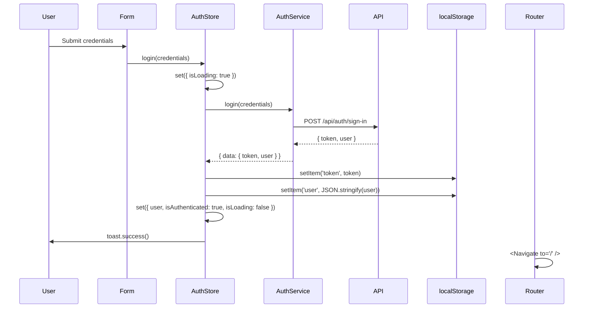

# Authentication Flow

## Overview

JWT-based authentication with localStorage persistence. No refresh tokens. No session management.

## Flow Diagram



## Token Storage

- Key: `'token'` in localStorage
- Sent on every request via `Authorization: Bearer <token>` header
- Read by `api/client.ts` on each request
- No expiry check on frontend (backend returns 401)

## Session Restoration

On page load, `authStore` calls `loadUser()`:

```typescript
function loadUser(): User | null {
  const stored = localStorage.getItem('user')
  const token = localStorage.getItem('token')
  if (stored && token) {
    try { return JSON.parse(stored) } catch { return null }
  }
  return null
}
```

Both `token` and `user` must exist in localStorage. Missing either → `user = null` → `isAuthenticated = false`.

## Logout

1. `localStorage.removeItem('token')`
2. `localStorage.removeItem('user')`
3. `set({ user: null, isAuthenticated: false, error: null })`
4. ProtectedRoute detects `isAuthenticated = false` → redirects to `/login`

No API call on logout (backend stateless).

## Registration

Same flow as login, but uses `POST /api/auth/sign-up` with `{ name, username, password }`. On success, token + user are stored and user is authenticated immediately (no email verification).

## Protection Layers

1. **Route-level**: `ProtectedRoute` wrapper → redirects to `/login`
2. **Component-level**: `LoginForm`/`RegisterForm` have `useEffect` → redirects to `/` if already authenticated
3. **API-level**: `api/client.ts` automatically includes JWT header. If token is invalid, backend responds 401, which the store handles via error state.

## Edge Cases

| Scenario | Behavior |
|---|---|
| Token expired (401 from API) | Backend returns error → store sets error → toast shown |
| localStorage cleared manually | `loadUser()` returns null → `isAuthenticated = false` |
| Register with existing username | Backend returns error → store sets error → form shows Alert |
| Login with wrong password | Backend returns error → store sets error → form shows Alert |
