# Module Map

Complete dependency graph of all modules.

```mermaid
graph TD
    subgraph "Entry"
        main[main.tsx]
        App[App.tsx]
    end

    subgraph "app/"
        providers[providers.tsx]
        router[router.tsx]
        MainPage[MainPage.tsx]
        NotFound[NotFoundPage.tsx]
    end

    subgraph "shared/"
        subgraph "api/"
            apiClient[api/client.ts]
            apiTypes[api/types.ts]
        end
        subgraph "lib/"
            apiReexport[lib/api.ts]
            utils[lib/utils.ts]
        end
        subgraph "types/"
            sharedTypes[types/index.ts]
        end
        subgraph "hooks/"
            useSidebar[hooks/useSidebar.ts]
            useMediaQuery[hooks/useMediaQuery.ts]
        end
        subgraph "constants/"
            zIndex[constants/zIndex.ts]
        end
        subgraph "components/"
            Layout[Layout.tsx]
            Header[Header.tsx]
            Sidebar[Sidebar.tsx]
            SidebarOverlay[SidebarOverlay.tsx]
            Sheet[Sheet.tsx]
            NavItems[NavItems.tsx]
            ProtectedRoute[ProtectedRoute.tsx]
            PublicRoute[PublicRoute.tsx]
            Toaster[Toaster.tsx]
            ui[ui/*]
        end
    end

    subgraph "features/auth/"
        authTypes[auth/types]
        authApi[auth/api/auth.service.ts]
        authReq[auth/api/requests.ts]
        authRes[auth/api/responses.ts]
        authStore[auth/store/authStore.ts]
        useAuth[auth/hooks/useAuth.ts]
        LoginForm[auth/components/LoginForm.tsx]
        RegisterForm[auth/components/RegisterForm.tsx]
        LoginPage[auth/pages/LoginPage.tsx]
        RegisterPage[auth/pages/RegisterPage.tsx]
        authIndex[auth/index.ts]
    end

    subgraph "features/map/"
        mapTypes[map/types]
        mapConstants[map/constants]
        mapMock[map/data/mockData.ts]
        mapStore[map/store/mapStore.ts]
        useMapData[map/hooks/useMapData.ts]
        MapView[map/components/MapView.tsx]
        MarkerLayer[map/components/MarkerLayer.tsx]
        RouteLayer[map/components/RouteLayer.tsx]
        PendingMarkerLayer[map/components/PendingMarkerLayer.tsx]
        MapControls[map/components/MapControls.tsx]
        FilterBar[map/components/FilterBar.tsx]
        RouteToolbar[map/components/RouteToolbar.tsx]
        DeliveryDetailPanel[map/components/DeliveryDetailPanel.tsx]
        RouteHistoryPanel[map/components/RouteHistoryPanel.tsx]
        CreateRoutePanel[map/components/CreateRoutePanel.tsx]
        AddDeliveryPanel[map/components/AddDeliveryPanel.tsx]
        MarkVisitedBanner[map/components/MarkVisitedBanner.tsx]
        MapPage[map/pages/MapPage.tsx]
        RouteDetailPage[map/pages/RouteDetailPage.tsx]
        mapIndex[map/index.ts]
    end

    subgraph "features/deliveries/"
        delTypes[deliveries/types]
        delApi[deliveries/api/delivery.service.ts]
        delReq[deliveries/api/requests.ts]
        delRes[deliveries/api/responses.ts]
        delIndex[deliveries/index.ts]
    end

    subgraph "features/routes/"
        routeTypes[routes/types]
        routeApi[routes/api/route.service.ts]
        routeReq[routes/api/requests.ts]
        routeRes[routes/api/responses.ts]
        routeIndex[routes/index.ts]
    end

    subgraph "features/orders/"
        ordersStub[orders/index.ts]
    end

    main --> App
    App --> providers
    providers --> router

    router --> authIndex
    router --> mapIndex
    router --> MainPage
    router --> NotFound
    router --> ProtectedRoute
    router --> PublicRoute
    router --> Layout

    Layout --> Sidebar
    Layout --> Header
    Sidebar --> NavItems
    Sidebar --> useSidebar
    Sidebar --> useMediaQuery
    Sidebar --> SidebarOverlay
    Header --> useAuth
    Header --> useSidebar

    ProtectedRoute --> useAuth
    PublicRoute --> useAuth

    authIndex --> LoginPage
    authIndex --> RegisterPage
    authIndex --> useAuth
    authIndex --> authStore
    authIndex --> authApi
    LoginPage --> LoginForm
    RegisterPage --> RegisterForm
    LoginForm --> useAuth
    RegisterForm --> useAuth
    useAuth --> authStore
    authStore --> authApi
    authApi --> apiClient

    mapIndex --> MapPage
    mapIndex --> RouteDetailPage
    mapIndex --> MapView
    mapIndex --> MarkerLayer
    mapIndex --> RouteLayer
    mapIndex --> mapStore
    mapIndex --> useMapData
    mapIndex --> mapTypes

    MapPage --> MapView
    MapPage --> mapStore
    MapPage --> useMapData
    MapPage --> AddDeliveryPanel
    MapPage --> CreateRoutePanel
    MapPage --> MarkVisitedBanner
    MapPage --> FilterBar
    MapPage --> DeliveryDetailPanel
    MapPage --> RouteHistoryPanel

    MapView --> MarkerLayer
    MapView --> RouteLayer
    MapView --> PendingMarkerLayer
    MapView --> MapControls
    MapView --> RouteToolbar

    mapStore --> delApi
    mapStore --> routeApi
    mapStore --> mapTypes
    mapStore --> delTypes
    mapStore --> routeTypes

    RouteDetailPage --> mapStore
    RouteDetailPage --> routeApi
    RouteDetailPage --> mapConstants

    useMapData --> mapStore

    delApi --> apiClient
    routeApi --> apiClient
    apiClient --> apiTypes
    apiReexport --> apiClient

    all[All components] --> ui
    all --> utils
    all --> cn[cn function]
```

## Key Dependencies

| Module | Depends On | Notes |
|---|---|---|
| `authStore` | `auth.service` → `api.client` | Full chain: store → service → client |
| `mapStore` | `delivery.service` + `route.service` | Dual API dependency |
| `mapStore` | `auth.deliveries/types` + `auth.routes/types` | Reuses service-layer types |
| `map/types` | `deliveries/types` + `routes/types` | Type aliases (DeliveryPoint = Delivery) |
| `MapPage` | `mapStore` + 7 map components | Orchestration hub |
| `Sidebar` | `useSidebar` (zustand) + `useMediaQuery` | UI state only |
| `Layout` | `Sidebar` + `Header` | Composition |
| Router | Feature barrel exports | Feature pages imported directly |
