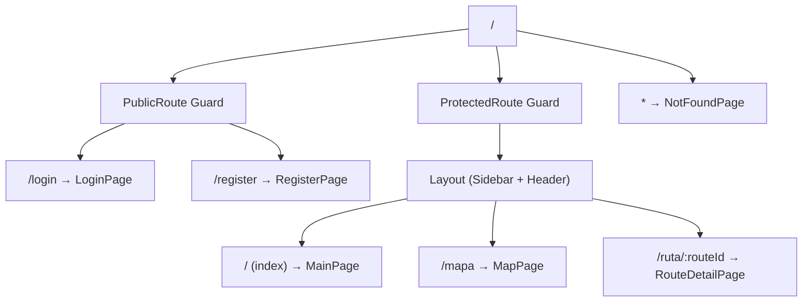

# Routing

## Router Configuration

Uses React Router v7 `createBrowserRouter` in `src/app/router.tsx`.

## Route Tree



## Route Table

| Path | Page | Guard | Notes |
|---|---|---|---|
| `/login` | LoginPage | PublicRoute | Redirects to `/` if authenticated |
| `/register` | RegisterPage | PublicRoute | Redirects to `/` if authenticated |
| `/` | MainPage | ProtectedRoute + Layout | Dashboard placeholder |
| `/mapa` | MapPage | ProtectedRoute + Layout | Main map interface |
| `/ruta/:routeId` | RouteDetailPage | ProtectedRoute + Layout | Route analytics view |
| `*` | NotFoundPage | None | 404 fallback |

## Guard Logic

### ProtectedRoute (`shared/components/ProtectedRoute.tsx`)

```
if (!isAuthenticated) → <Navigate to="/login" replace />
else → <Outlet />
```

Reads `isAuthenticated` from `useAuth()` hook (authStore).

### PublicRoute (`shared/components/PublicRoute.tsx`)

```
if (isAuthenticated) → <Navigate to="/" replace />
else → <Outlet />
```

### Auth Redirect in Forms

`LoginForm` and `RegisterForm` mount a `useEffect` that navigates to `/` if `isAuthenticated` changes (belt-and-suspenders with PublicRoute guard).

## Layout Nesting

Protected routes are wrapped in:
1. `ProtectedRoute` — auth check
2. `Layout` — Sidebar + Header + `<Outlet />`

The Layout is **not** rendered for public routes (login/register are full-screen forms).

## Programmatic Navigation

- **Logout**: `authStore.logout()` clears localStorage + state, triggering ProtectedRoute redirect
- **Route detail**: `useNavigate()('/ruta/' + id)` from RouteHistoryPanel
- **Map → Back**: `useNavigate()('/mapa')` from RouteDetailPage
