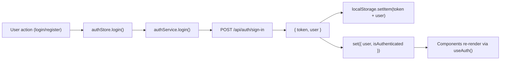
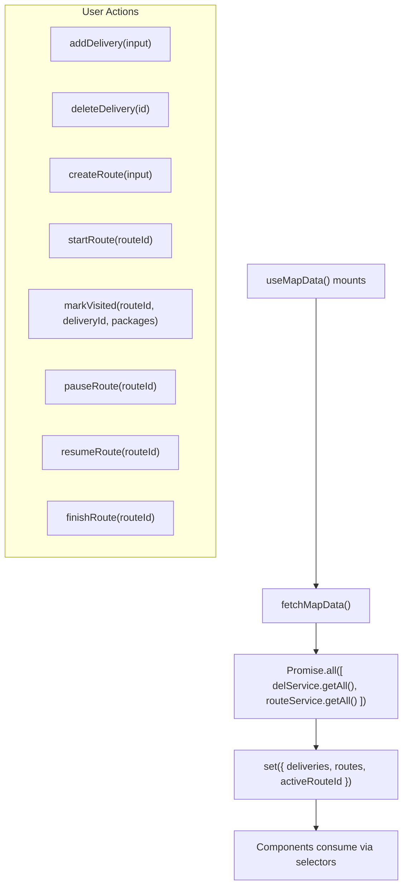

# State Management

## Store Inventory

| Store | File | Type | Persistence |
|---|---|---|---|
| `useAuthStore` | `features/auth/store/authStore.ts` | Zustand | localStorage (token + user) |
| `useMapStore` | `features/map/store/mapStore.ts` | Zustand | None (in-memory only) |
| `useSidebar` | `shared/hooks/useSidebar.ts` | Zustand | None (UI state) |

## No React Context

The application has **zero React Context providers** for state. All shared state is in Zustand stores. The only providers are `RouterProvider` (from react-router) and `Toaster` (from sonner).

## Auth Store



**State shape**: `user: User | null`, `isAuthenticated: boolean`, `isLoading: boolean`, `error: string | null`

**Actions**: `login`, `register`, `logout`, `clearError`

**Persistence**: On app load, `loadUser()` reads `localStorage.getItem('user')` + `localStorage.getItem('token')`.

## Map Store



**State shape**: `deliveries: DeliveryPoint[]`, `routes: Route[]`, `selectedDeliveryId: string | null`, `activeRouteId: string | null`, `pendingLocation: { lat, lng }`, `isPlacing: boolean`, `isLoading: boolean`, `isCreatingRoute: boolean`, `error: string | null`, `isFullscreen: boolean`, `filters: { status }`, `showRoutes: boolean`, `showMarkers: boolean`

**Actions**: 22 actions total. See `features/map/types/index.ts:MapActions`.

**Active route auto-detection**: `fetchMapData` finds the first `in_progress` or `paused` route and sets it as `activeRouteId`.

**Optimistic updates**: Most actions (startRoute, markVisited, pauseRoute, resumeRoute, finishRoute) update local state immediately before API response, then merge API data if it returns different values.

## Sidebar Store

Minimal UI-only store. Controls:
- `isOpen` (mobile toggle)
- `isCollapsed` (desktop collapse)
- `toggle()`, `open()`, `close()`, `toggleCollapse()`

Responsive behavior: On desktop (`≥1024px`), sidebar is always visible (collapsible). On mobile, sidebar slides in/out with overlay.

## Data Flow Pattern

All feature stores follow this pattern:

```
User Interaction → Store Action → Service Call → API Request
                                                      ↓
Component Re-render ← Zustand State Update ← API Response
```

Error handling: If API returns error, store sets `error` state AND calls `toast.error()` (Sonner). Error is displayed both as Zustand state and as toast notification.

## Selectors

Hooks use individual selectors to minimize re-renders:

```typescript
// useAuth hook (auth/hooks/useAuth.ts)
const user = useAuthStore((state) => state.user)         // Only re-renders if user changes
const isLoading = useAuthStore((state) => state.isLoading) // Only re-renders if isLoading changes
```

In components, direct `useMapStore(selector)` is used:

```typescript
// MapPage.tsx
const deliveries = useMapStore((s) => s.deliveries)
const selectedDeliveryId = useMapStore((s) => s.selectedDeliveryId)
```

This is the Zustand recommended pattern (individual selectors vs. destructuring the whole store).
