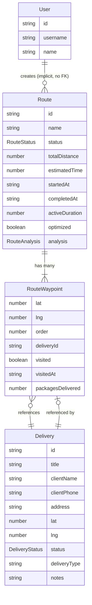

# Domain Entities

## Entity Relationship Diagram



## Entity Definitions

### User

| Attribute | Type | Required | Notes |
|---|---|---|---|
| `id` | `string` | yes | UUID from backend |
| `username` | `string` | yes | Unique, min 3 chars |
| `name` | `string` | yes | Display name |

**Source**: `features/auth/types/index.ts`

Stored in localStorage alongside JWT token. No password stored on client.

---

### Delivery

Alternative names in code: `DeliveryPoint` (alias in `map/types`).

| Attribute | Type | Required | Notes |
|---|---|---|---|
| `id` | `string` | yes | UUID from backend |
| `title` | `string` | yes | Title/description of the delivery |
| `clientName` | `string` | yes | Client's full name |
| `clientPhone` | `string?` | no | Contact phone number |
| `address` | `string` | yes | Textual address (e.g. "Cra 5 #10-20") |
| `lat` | `number` | yes | Latitude (WGS84, min 6 decimals) |
| `lng` | `number` | yes | Longitude (WGS84, min 6 decimals) |
| `status` | `DeliveryStatus` | yes | `pending`, `in_transit`, or `delivered` |
| `type` | `DeliveryType?` | no | `delivery`, `warehouse`, or `client` |
| `notes` | `string?` | no | Free text notes (e.g. "Dejar en porteria") |

**Source**: `features/deliveries/types/index.ts`

---

### Route

| Attribute | Type | Required | Notes |
|---|---|---|---|
| `id` | `string` | yes | UUID from backend |
| `name` | `string` | yes | Human-readable name |
| `status` | `RouteStatus` | yes | `draft`, `in_progress`, `paused`, or `completed` |
| `waypoints` | `RouteWaypoint[]` | yes | Ordered list of stops |
| `totalDistance` | `number?` | no | Total route distance in km |
| `estimatedTime` | `number?` | no | Estimated time in minutes |
| `startedAt` | `string?` | no | ISO date when route was started |
| `completedAt` | `string?` | no | ISO date when route was completed |
| `activeDuration` | `number` | yes | Total active time in seconds |
| `optimized` | `boolean?` | no | Whether route order was optimized |
| `analysis` | `RouteAnalysis?` | no | Computed analytics (populated on complete) |

**Source**: `features/routes/types/index.ts`

---

### RouteWaypoint

Embedded in Route. Has no independent lifecycle.

| Attribute | Type | Required | Notes |
|---|---|---|---|
| `lat` | `number` | yes | Latitude of the waypoint |
| `lng` | `number` | yes | Longitude of the waypoint |
| `order` | `number` | yes | 0-based sequence in the route |
| `deliveryId` | `string` | yes | References `Delivery.id` |
| `visited` | `boolean` | yes | Whether the driver visited this stop |
| `visitedAt` | `string?` | no | ISO date when mark visited |
| `packagesDelivered` | `number?` | no | Number of packages delivered at this stop |

**Source**: `features/routes/types/index.ts`

---

### RouteAnalysis

Computed statistics, available only for completed routes.

| Attribute | Type | Notes |
|---|---|---|
| `totalDeliveries` | `number` | Total waypoints in the route |
| `delivered` | `number` | Waypoints marked as visited |
| `notDelivered` | `number` | `totalDeliveries - delivered` |
| `activeTimeHours` | `number` | Active duration in hours |
| `completionRate` | `number` | Percentage: `(delivered / totalDeliveries) * 100` |

---

## Type Hierarchies

### Frontend Type Aliases (map/types)

```typescript
type DeliveryPoint = Delivery              // from deliveries/types
type Route = Route                         // from routes/types (re-export)
type RouteWaypoint = RouteWaypoint         // from routes/types (re-export)
type CreateDeliveryInput = CreateDeliveryRequest  // from deliveries/api/requests
type CreateRouteInput = CreateRouteRequest      // from routes/api/requests
type MarkVisitedInput = VisitWaypointRequest    // from routes/api/requests
```

### API Layer Types

- **Requests** (`features/<name>/api/requests.ts`): Input types for API calls
- **Responses** (`features/<name>/api/responses.ts`): Return types from API calls
- **Domain types** (`features/<name>/types/index.ts`): Core business types

The map feature creates aliases to avoid direct cross-feature imports in components.
