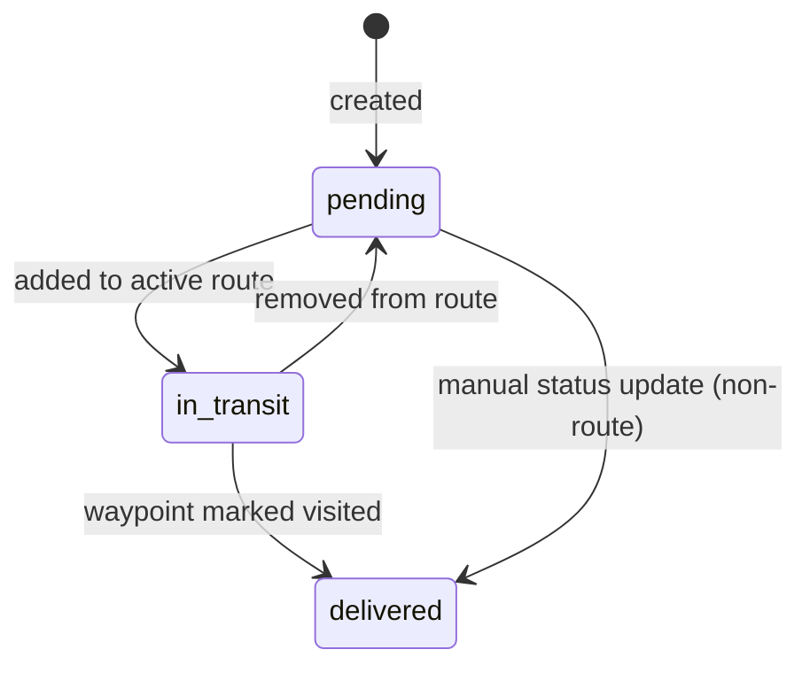
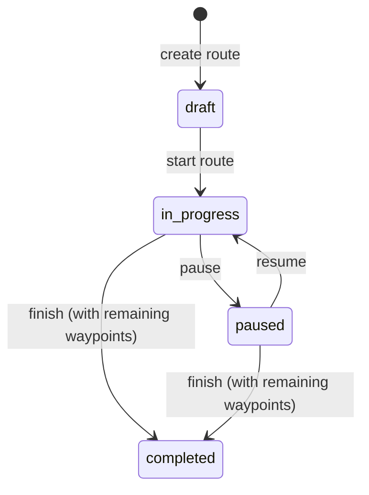

# State Machines

## Delivery Status

### Transitions

| From | To | Trigger | API Call |
|---|---|---|---|
| `pending` | `in_transit` | Route containing delivery is started | `PUT /routes/:id/start` (side effect in store: batch updates all waypoint deliveries to in_transit) |
| `in_transit` | `delivered` | Waypoint marked as visited | `PUT /routes/:routeId/waypoints/:deliveryId/visit` |
| `in_transit` | `pending` | Delivery removed from route | Implicit via route modification |
| `pending` | `delivered` | Manual status update | `PUT /deliveries/:id/status` |

### Visual Encoding (Map)

| Status | Color | Hex |
|---|---|---|
| `pending` | Amber | `#f59e0b` |
| `in_transit` | Blue | `#2563eb` |
| `delivered` | Green | `#16a34a` |

---

## Route Status

### Transitions

| From | To | Trigger | API Call | Side Effects |
|---|---|---|---|---|
| `draft` | `in_progress` | User clicks "Iniciar" | `PUT /routes/:id/start` | All waypoint deliveries set to `in_transit`, all `visited = false` reset |
| `in_progress` | `paused` | User clicks "Pausar" | `PUT /routes/:id/pause` | None |
| `paused` | `in_progress` | User clicks "Reanudar" | `PUT /routes/:id/resume` | None |
| `in_progress` | `completed` | User clicks "Finalizar" | `PUT /routes/:id/complete` | Route analysis computed, unvisited waypoints stay undelivered |
| `paused` | `completed` | User clicks "Finalizar" | `PUT /routes/:id/complete` | Same as in_progress → completed |

### Business Rules

- Only one route can be `in_progress` or `paused` at a time (enforced by UI: draft route toolbar hidden when active route exists).
- Completing a route does NOT require all waypoints to be visited.
- `activeDuration` tracks total time spent in `in_progress` state (paused time excluded).
- Waypoint `visited` flags are reset to `false` when route transitions `draft → in_progress`.

### Visual Encoding (Map)

| Status | Color | Hex | RouteLine |
|---|---|---|---|
| `draft` | Gray | `#6b7280` | Dashed |
| `in_progress` | Blue | `#2563eb` | Solid |
| `paused` | Amber | `#f59e0b` | Solid |
| `completed` | Green | `#16a34a` | Solid (only in history panel) |
