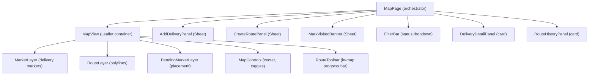

# Map Feature

**Location**: `src/features/map/`  
**Type**: Full-stack feature  
**Routes**: `/mapa`, `/ruta/:routeId`  
**Dependencies**: `features/deliveries`, `features/routes`, `shared/*`

## Responsibility

Interactive map for managing deliveries and routes in Aguachica. This is the **core feature** of the application.

## Component Architecture



## Files

### Core

| File | Role |
|---|---|
| `types/index.ts` | Type aliases + MapState + MapActions |
| `constants/index.ts` | Center coords, zoom, colors, labels |
| `data/mockData.ts` | Dev-only mock data (not used in prod) |
| `store/mapStore.ts` | Main Zustand store (22 actions) |
| `hooks/useMapData.ts` | Data fetching hook |

### Pages

| File | Route | Purpose |
|---|---|---|
| `pages/MapPage.tsx` | `/mapa` | Main map with all panels |
| `pages/RouteDetailPage.tsx` | `/ruta/:routeId` | Route analytics view |

### Components

Detailed description of each component.

## MapPage

The orchestrator. Renders:

```
[Map (responsive height: 63dvh mobile / 40dvh desktop)]
├── Loading overlay (if isLoading)
├── Error banner (if error)
├── Empty state (if isEmpty)
├── Placing mode banner (if isPlacing)
├── FAB buttons: +Add, Route, Flag (context-dependent)
├── Fullscreen toggle
├── RouteToolbar (if draft/active route, inside map)
├── MapControls (center, toggle layers, inside map)
└── MapView

[Below map (hidden in fullscreen)]
├── FilterBar (if active route exists)
├── DeliveryDetailPanel (if delivery selected)
└── RouteHistoryPanel (completed routes list)
```

## MapView

Leaflet `MapContainer` wrapper. Non-negotiable setup:
- Center: `[8.3089, -73.615]` (Aguachica)
- Zoom: 14, Min zoom: 12
- Tiles: OpenStreetMap
- ZoomControl at `bottomright`
- `MapClickHandler` — captures clicks when in placing mode
- `MapResizer` — calls `map.invalidateSize()` on fullscreen toggle

## MarkerLayer

Renders `Marker` + `Popup` for each delivery (respecting `showMarkers` and `filters.status`).

**Marker visual rules**:
- No active route → all markers gray (`#64748b`)
- Active route → color by status: pending = amber, in_transit = blue, delivered = green
- Selected marker → size 14px + thicker border + shadow ring
- Visited waypoint → size 12px + green background + white checkmark SVG
- Pending waypoint → color forced to amber regardless of actual status

**Popup**: Dark-themed (`custom-dark-popup` class), shows client name, address, phone, notes, status badge.

## RouteLayer

Renders `Polyline` for each route (respecting `showRoutes`). Color by `ROUTE_STATUS_COLORS`. Tooltip shows route name and distance.

## PendingMarkerLayer

Single pulsing marker at `pendingLocation` when user has clicked the map in placing mode.

## RouteToolbar

In-map overlay (top-center):
- **Draft route**: Shows route name + "Iniciar" button
- **Active route** (in_progress/paused): Progress bar (visited/total), Pause/Resume button, "Finalizar" button
- **No route**: Hidden

## MapControls

Bottom-left floating buttons:
- Center map (fly to Aguachica)
- Toggle routes visibility
- Toggle markers visibility

## CreateRoutePanel

Sheet (`position="right"`) for creating a new route:
- Name input
- Optimize checkbox
- Delivery selection list (checkboxes with client name + address)
- Select all / count display
- "Crear ruta" submit button

Only rendered when `isCreatingRoute = true`.

## AddDeliveryPanel

Sheet (`position="right"`) for adding a delivery at coordinates:
- Shows lat/lng from `pendingLocation`
- Form: clientName (required), phone (optional), address (required), notes (optional)
- Validated with zod schema
- Submit calls `mapStore.addDelivery()`

Only rendered when `pendingLocation.lat !== null && pendingLocation.lng !== null`.

## MarkVisitedBanner

Sheet (`position="bottom"`) for confirming delivery completion:
- Shows client name and address
- Packages delivered counter (+/- buttons + number input)
- Confirm / Cancel buttons

Visibility gated by: open prop + active route + selected waypoint + waypoint not visited.

## FilterBar

Status filter dropdown below the map. Only rendered when an active route exists. Values: Todos, Pendiente, En transito, Entregado.

## DeliveryDetailPanel

Card showing selected delivery info below the map. If no selection, shows placeholder text. Features: client name, address, phone, status indicator, notes, delete button (only when active route exists).

## RouteHistoryPanel

Card showing completed routes sorted by date (most recent first). Each route row:
- Expandable (ChevronRight/ChevronDown toggle)
- Shows name, date, visited count
- External link button → navigates to `/ruta/:routeId`
- Expanded view: analysis stats + waypoint list with visited/non-visited indicators

## RouteDetailPage

Standalone page for route analytics. Has its own Leaflet map + stats cards + delivery list. Fetches route by ID from store first, falls back to API. Shows 4 stat cards (delivered, not delivered, effectiveness %, active hours). Numbered delivery list with visited/not visited indicators.

## Store Flow (MapPage Lifecycle)

```
MapPage mounts
  → useMapData() calls fetchMapData()
    → Promise.all([deliveryService.getAll(), routeService.getAll()])
    → set({ deliveries, routes, activeRouteId (auto-detected) })
  → Components render with data

User creates route
  → mapStore.createRoute(input)
    → routeService.create(input)
    → set({ routes: [...routes, newRoute] })
    → auto-set activeRouteId if in_progress

User starts route
  → mapStore.startRoute(routeId)
    → routeService.start(routeId)
    → Batch update: all waypoints → visited=false + reset
    → Batch update: all waypoint deliveries → in_transit

User marks visited
  → mapStore.markVisited(routeId, deliveryId, packages)
    → routeService.visitWaypoint(routeId, deliveryId, { packagesDelivered })
    → Update delivery status → delivered
    → Update waypoint → visited=true + visitedAt + packagesDelivered

User finishes route
  → mapStore.finishRoute(routeId)
    → routeService.complete(routeId)
    → Update route → completed + analysis
    → Clear activeRouteId
```
