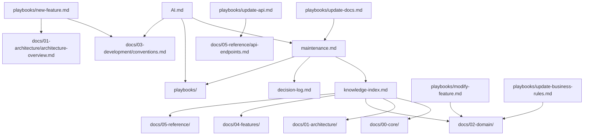

# Knowledge Index

Semantic map of the entire project knowledge system.

---

## Semantic Index

### Entities — Where Defined

| Entity | Code Types | Domain Doc | Feature Docs |
|---|---|---|---|
| `User` | `features/auth/types/index.ts` | `02-domain/entities.md` | `04-features/auth.md` |
| `Delivery` / `DeliveryPoint` | `features/deliveries/types/index.ts`, `features/map/types/index.ts` | `02-domain/entities.md` | `04-features/deliveries.md`, `04-features/map.md` |
| `Route` | `features/routes/types/index.ts`, `features/map/types/index.ts` | `02-domain/entities.md` | `04-features/routes-feature.md`, `04-features/map.md` |
| `RouteWaypoint` | `features/routes/types/index.ts` | `02-domain/entities.md` | `04-features/routes-feature.md` |
| `RouteAnalysis` | `features/routes/types/index.ts` | `02-domain/entities.md` | `04-features/routes-feature.md` |

### Features — Where Located

| Feature | Type | Code Root | Docs |
|---|---|---|---|
| `auth` | Full-stack | `src/features/auth/` | `04-features/auth.md` |
| `map` | Full-stack | `src/features/map/` | `04-features/map.md` |
| `deliveries` | API-only | `src/features/deliveries/` | `04-features/deliveries.md` |
| `routes` | API-only | `src/features/routes/` | `04-features/routes-feature.md` |
| `orders` | Stub | `src/features/orders/` | — |
| `sales` | Stub (placeholder page) | `src/features/sales/` | — |

### Shared Components — Where Located

| Component | File | Docs |
|---|---|---|
| `Layout` | `src/shared/components/Layout.tsx` | `01-architecture/architecture-overview.md` |
| `Header` | `src/shared/components/Header.tsx` | `01-architecture/architecture-overview.md` |
| `Sidebar` | `src/shared/components/Sidebar.tsx` | `01-architecture/architecture-overview.md` |
| `SidebarOverlay` | `src/shared/components/SidebarOverlay.tsx` | `01-architecture/architecture-overview.md` |
| `Sheet` | `src/shared/components/Sheet.tsx` | `01-architecture/architecture-overview.md` |
| `NavItems` | `src/shared/components/NavItems.tsx` | `01-architecture/routing.md` |
| `ProtectedRoute` | `src/shared/components/ProtectedRoute.tsx` | `01-architecture/routing.md`, `01-architecture/auth-flow.md` |
| `PublicRoute` | `src/shared/components/PublicRoute.tsx` | `01-architecture/routing.md`, `01-architecture/auth-flow.md` |
| `Toaster` | `src/shared/components/Toaster.tsx` | `00-core/tech-stack.md` |
| `Button` | `src/shared/components/ui/button.tsx` | `03-development/conventions.md` |
| `Card` | `src/shared/components/ui/card.tsx` | `03-development/conventions.md` |
| `Input` | `src/shared/components/ui/input.tsx` | `03-development/conventions.md` |
| `Label` | `src/shared/components/ui/label.tsx` | `03-development/conventions.md` |
| `Select` | `src/shared/components/ui/select.tsx` | `03-development/conventions.md` |
| `Textarea` | `src/shared/components/ui/textarea.tsx` | `03-development/conventions.md` |
| `Checkbox` | `src/shared/components/ui/checkbox.tsx` | `03-development/conventions.md` |
| `Badge` | `src/shared/components/ui/badge.tsx` | `03-development/conventions.md` |
| `Alert` | `src/shared/components/ui/alert.tsx` | `03-development/conventions.md` |
| `Separator` | `src/shared/components/ui/separator.tsx` | `03-development/conventions.md` |
| `Skeleton` | `src/shared/components/ui/skeleton.tsx` | `03-development/conventions.md` |
| `Table` | `src/shared/components/ui/table.tsx` | `03-development/conventions.md` |
| `ConfirmDialog` | `src/shared/components/ui/confirm-dialog.tsx` | — |

### Map Components — Where Located

| Component | File | Docs |
|---|---|---|
| `MapView` | `src/features/map/components/MapView.tsx` | `04-features/map.md` |
| `MarkerLayer` | `src/features/map/components/MarkerLayer.tsx` | `04-features/map.md` |
| `RouteLayer` | `src/features/map/components/RouteLayer.tsx` | `04-features/map.md` |
| `PendingMarkerLayer` | `src/features/map/components/PendingMarkerLayer.tsx` | `04-features/map.md` |
| `MapControls` | `src/features/map/components/MapControls.tsx` | `04-features/map.md` |
| `FilterBar` | `src/features/map/components/FilterBar.tsx` | `04-features/map.md` |
| `RouteToolbar` | `src/features/map/components/RouteToolbar.tsx` | `04-features/map.md` |
| `DeliveryDetailPanel` | `src/features/map/components/DeliveryDetailPanel.tsx` | `04-features/map.md` |
| `RouteHistoryPanel` | `src/features/map/components/RouteHistoryPanel.tsx` | `04-features/map.md` |
| `CreateRoutePanel` | `src/features/map/components/CreateRoutePanel.tsx` | `04-features/map.md` |
| `AddDeliveryPanel` | `src/features/map/components/AddDeliveryPanel.tsx` | `04-features/map.md` |
| `MarkVisitedBanner` | `src/features/map/components/MarkVisitedBanner.tsx` | `04-features/map.md` |

### Stores — Where Located

| Store | File | Docs |
|---|---|---|
| `useAuthStore` | `src/features/auth/store/authStore.ts` | `01-architecture/state-management.md`, `01-architecture/auth-flow.md` |
| `useMapStore` | `src/features/map/store/mapStore.ts` | `01-architecture/state-management.md`, `04-features/map.md` |
| `useSidebar` | `src/shared/hooks/useSidebar.ts` | `01-architecture/state-management.md` |

### Hooks — Where Located

| Hook | File | Docs |
|---|---|---|
| `useAuth` | `src/features/auth/hooks/useAuth.ts` | `04-features/auth.md` |
| `useMapData` | `src/features/map/hooks/useMapData.ts` | `04-features/map.md` |
| `useMediaQuery` | `src/shared/hooks/useMediaQuery.ts` | — |
| `useSidebar` | `src/shared/hooks/useSidebar.ts` | `01-architecture/state-management.md` |

### Services — Where Located

| Service | File | Docs |
|---|---|---|
| `authService` | `src/features/auth/api/auth.service.ts` | `04-features/auth.md`, `05-reference/api-endpoints.md` |
| `deliveryService` | `src/features/deliveries/api/delivery.service.ts` | `04-features/deliveries.md`, `05-reference/api-endpoints.md` |
| `routeService` | `src/features/routes/api/route.service.ts` | `04-features/routes-feature.md`, `05-reference/api-endpoints.md` |
| `api` (client) | `src/shared/api/client.ts` | `05-reference/api-endpoints.md`, `03-development/conventions.md` |

---

## Document Index

### Project Root

| File | Purpose |
|---|---|
| `AI.md` | Project Constitution — operative rules for AI agents |
| `AGENTS.md` | Quick reference — stack, routes, structure |
| `maintenance.md` | Protocol — how to keep docs synchronized with code |
| `API-CONTRATO.md` | Full backend API contract |
| `PLAN.md` | Original feature development plan |
| `README.md` | Project README (standard npm/boot) |

### Playbooks

| File | Purpose |
|---|---|
| `docs/playbooks/new-feature.md` | Create a new feature module |
| `docs/playbooks/modify-feature.md` | Change existing feature code |
| `docs/playbooks/fix-bug.md` | Fix a bug |
| `docs/playbooks/add-component.md` | Add a UI or feature component |
| `docs/playbooks/update-business-rules.md` | Change domain rules/entities |
| `docs/playbooks/update-api.md` | Change API endpoints/types |
| `docs/playbooks/update-docs.md` | Pure documentation update |

### 00 — Core

| File | Responsibility |
|---|---|
| `docs/00-core/overview.md` | Project purpose, users, scope |
| `docs/00-core/tech-stack.md` | All technologies with versions and purpose |
| `docs/00-core/glossary.md` | Business and technical terms dictionary |

### 01 — Architecture

| File | Responsibility |
|---|---|
| `docs/01-architecture/architecture-overview.md` | FSD layers, dependency rules, component catalog |
| `docs/01-architecture/module-map.md` | Module dependency graph (Mermaid) |
| `docs/01-architecture/routing.md` | Routes, guards, layout nesting |
| `docs/01-architecture/state-management.md` | Stores, hooks, data flows |
| `docs/01-architecture/auth-flow.md` | Authentication flow (login, JWT, guards) |

### 02 — Domain

| File | Responsibility |
|---|---|
| `docs/02-domain/entities.md` | All business entities with attributes and ERD |
| `docs/02-domain/state-machines.md` | Status transitions for deliveries and routes |
| `docs/02-domain/business-rules.md` | Business invariants and constraints |

### 03 — Development

| File | Responsibility |
|---|---|
| `docs/03-development/conventions.md` | Code style, naming, file organization, patterns |

### 04 — Features

| File | Responsibility |
|---|---|
| `docs/04-features/auth.md` | Auth feature (login, register, JWT) |
| `docs/04-features/map.md` | Map feature (Leaflet, routes, interactions) |
| `docs/04-features/deliveries.md` | Deliveries API layer |
| `docs/04-features/routes-feature.md` | Routes API layer |

### 05 — Reference

| File | Responsibility |
|---|---|
| `docs/05-reference/api-endpoints.md` | Complete API endpoint reference |
| `docs/05-reference/configuration.md` | Vite, Tailwind, TypeScript, oxlint configs |

---

## Cross-Reference Map

